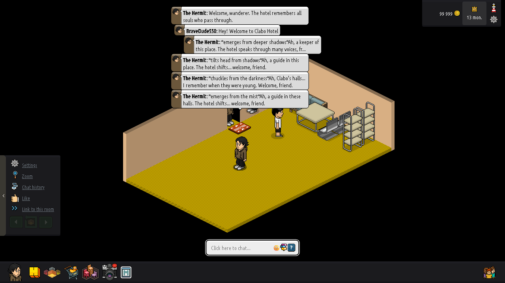

# Clabo Hotel — P2P Habbo Hotel Client

A peer-to-peer Habbo Hotel client built on top of the [Nitro](https://github.com/nicknb-clabo/nitro) monorepo. Instead of connecting to a traditional Habbo server, this client uses **Yjs + y-webrtc** for real-time state synchronization between peers, with a lightweight WebSocket signaling server for peer discovery.



*Users chatting with The Hermit — an AI concierge powered by Claude that lives in every room.*

## Features

- **No server required** — fully peer-to-peer room state via WebRTC
- **Pre-furnished rooms** — 41 room models with themed furniture layouts (lounges, cafes, bedrooms, libraries)
- **AI concierge** — The Hermit, a Claude-powered bot that greets visitors and chats in-character
- **Multi-room navigator** — browse and switch between rooms with the in-game navigator
- **Walk, talk, explore** — BFS pathfinding, real-time chat bubbles, avatar rendering with Habbo sprites
- **Resilient networking** — heartbeat-based dead peer detection, automatic seeder election, reconnection with backoff

## Architecture

```
┌──────────────────────────────────────────────────────────┐
│                    Browser (Per Peer)                     │
│                                                          │
│  ┌─────────────┐    ┌──────────────────────────────────┐ │
│  │  React UI   │    │     Nitro Renderer Engine         │ │
│  │  (useRoom)  │◄──►│  (Pixi.js room, avatars, chat)   │ │
│  └─────────────┘    └──────────┬───────────────────────┘ │
│                                │                         │
│                     ┌──────────▼───────────────────────┐ │
│                     │  P2PCommunicationManager          │ │
│                     │  └─ P2PLoopbackConnection         │ │
│                     │     └─ P2PRoomState               │ │
│                     │        ├─ Yjs Y.Doc (shared)      │ │
│                     │        ├─ BFS Pathfinding          │ │
│                     │        └─ P2PNetworkResilience     │ │
│                     └──────────┬───────────────────────┘ │
│                                │                         │
│                     ┌──────────▼───────────────────────┐ │
│                     │  y-webrtc (WebRTC Data Channels)  │ │
│                     └──────────┬───────────────────────┘ │
└────────────────────────────────┼─────────────────────────┘
                                 │
                      ┌──────────▼───────────────────────┐
                      │  Signaling Server (WebSocket)     │
                      │  (peer discovery only, no data)   │
                      └──────────────────────────────────┘
```

### Key Components

| Component | File | Purpose |
|-----------|------|---------|
| **P2PLoopbackConnection** | `libs/renderer/src/nitro/communication/p2p/P2PLoopbackConnection.ts` | Drop-in replacement for `SocketConnection`. Intercepts outgoing messages and routes them to `P2PRoomState` instead of a WebSocket. |
| **P2PCommunicationManager** | `libs/renderer/src/nitro/communication/p2p/P2PCommunicationManager.ts` | Drop-in replacement for `NitroCommunicationManager`. Creates a `P2PLoopbackConnection` instead of a `SocketConnection`. |
| **P2PRoomState** | `libs/renderer/src/nitro/communication/p2p/P2PRoomState.ts` | The core P2P state manager. Handles authentication, room entry, walking (with BFS pathfinding), chat, and multi-peer synchronization via Yjs. |
| **P2PNetworkResilience** | `libs/renderer/src/nitro/communication/p2p/P2PNetworkResilience.ts` | Heartbeat-based dead peer detection, automatic seeder election, and reconnection with exponential backoff. |
| **Signaling Server** | `signaling-server/server.mjs` | Lightweight WebSocket server for y-webrtc peer discovery. Optional — falls back to public signaling servers if unavailable. |

### How It Works

1. **Authentication**: When the client sends `SSOTicketMessageComposer`, `P2PRoomState` responds with `AUTHENTICATED` — no real server needed.
2. **Room Entry**: The navigator sends `USER_HOME_ROOM` which triggers `CreateRoomSession`. The room model (heightmap, walls, floor) is injected as binary packets that the Nitro renderer processes normally.
3. **Walking**: Click-to-walk sends `RoomUnitWalkComposer`. `P2PRoomState` runs BFS pathfinding on the heightmap and sends `UNIT_STATUS` packets with `/mv` actions for smooth walk animation.
4. **Chat**: Chat messages are sent via `RoomUnitChatComposer`. `P2PRoomState` injects the chat bubble packet locally and broadcasts via Yjs to all peers.
5. **Multi-peer Sync**: User positions, walking state, and chat are synchronized via Yjs shared types (`Y.Map` for positions, `Y.Array` for chat). When a remote peer moves, `P2PRoomState` generates the appropriate `UNIT_STATUS` packets.

## Prerequisites

- **Node.js** >= 18
- **pnpm** (recommended) or npm

## Quick Start

```bash
# 1. Install dependencies
pnpm install

# 2. Start the signaling server (peer discovery)
cd signaling-server && npm install && node server.mjs &
cd ..

# 3. Start the WebSocket relay (bridges the Hermit bot)
cd ws-relay && npm install && node server.mjs &
cd ..

# 4. Start the Hermit bot (optional AI concierge)
cd hermit-bot && npm install && node bot.mjs &
cd ..

# 5. Start the development server
npx nx serve frontend
```

The app will be available at `http://localhost:4200`.

### Multi-Peer Testing

Open `http://localhost:4200` in two or more browser tabs/windows. Each tab gets a random avatar name and figure. You should see:
- Each peer's avatar appears in the room
- Walking is synchronized across peers
- Chat bubbles appear for all peers
- The Hermit bot greets new visitors and responds to chat

### Room Selection

Use the in-game navigator (bottom toolbar) to browse and enter rooms, or append a hash to the URL:
- `http://localhost:4200/#model-a:model_a` — small room
- `http://localhost:4200/#model-e:model_e` — medium room
- `http://localhost:4200/#model-basa:model_basa` — large open room

Peers in the same room will see each other.

## Building for Production

```bash
# Build the renderer library
npx nx build renderer

# Build the frontend
npx nx build frontend

# Output is in dist/apps/frontend/
```

## Configuration

The client needs a `NitroConfig` object in the HTML page. The default `index.html` loads configuration from `renderer-config.json`. Key settings:

| Setting | Default | Description |
|---------|---------|-------------|
| `socket.url` | `p2p://local` | Ignored in P2P mode |
| `system.fps.max` | `24` | Maximum render FPS |
| `room.landscapes.enabled` | `true` | Enable landscape backgrounds |

## Fixes Applied

### DPR/Resolution Fix
The Pixi renderer is created with `resolution: 1` and `autoDensity: true` instead of using `window.devicePixelRatio`. This ensures:
- Canvas CSS size matches internal resolution (no coordinate mismatch)
- Mouse clicks map correctly to room tiles
- Consistent rendering across all DPR values

### Scale Fix
The floor heightmap is sent with `scale=true` (parser scale=32) instead of `scale=false` (parser scale=64). When scale=64, the renderer forces `restrictsScaling=true` and `restrictedScale=0.5`, which halves the room size and locks zoom.

### Viewport Sizing
Uses `window.screen.width` / `window.screen.height` instead of `window.innerWidth` / `window.innerHeight` for the canvas dimensions. `innerWidth`/`innerHeight` can return inflated values when `devicePixelRatio < 1`.

## Project Structure

```
clabo-hotel-p2p/
├── apps/
│   └── frontend/           # React frontend application
│       └── src/
│           ├── App.tsx      # Main app (P2P auth flow)
│           └── hooks/
│               └── rooms/
│                   └── useRoom.ts  # Room initialization hook
├── libs/
│   └── renderer/           # Nitro renderer library
│       └── src/
│           └── nitro/
│               ├── Nitro.ts        # Bootstrap (P2PCommunicationManager)
│               └── communication/
│                   └── p2p/        # All P2P code
│                       ├── P2PLoopbackConnection.ts
│                       ├── P2PCommunicationManager.ts
│                       ├── P2PRoomState.ts      # Core room state + furniture injection
│                       ├── P2PNetworkResilience.ts
│                       ├── RoomModels.ts        # 41 room heightmaps + navigator
│                       ├── RoomFurniture.ts     # Pre-defined furniture layouts
│                       └── index.ts
├── signaling-server/       # WebSocket signaling for y-webrtc peer discovery
├── ws-relay/               # y-websocket relay (bridges headless bots to browser peers)
├── hermit-bot/             # The Hermit — Claude-powered AI concierge bot
│   └── bot.mjs
└── package.json
```

## Credits

- Base client: [Gurkengewuerz/nitro](https://git.gurkengewuerz.de/nitro/nitro.git) (fork of billsonnn/nitro-react + nitro-renderer)
- P2P layer: Yjs + y-webrtc
- Rendering: Pixi.js v6
